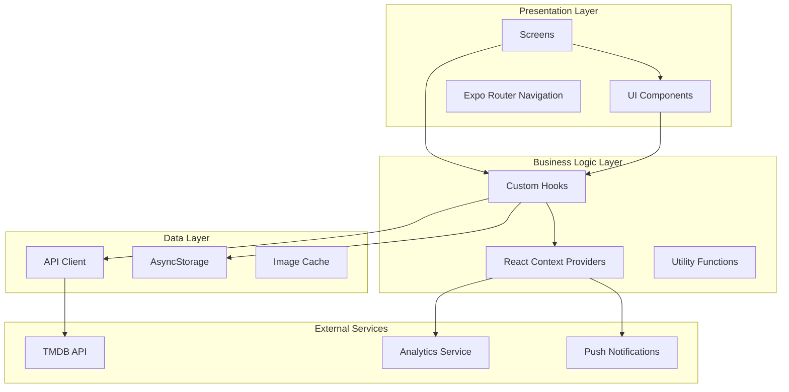

# Design Document: MovieStream MVP

## Overview

MovieStream is a React Native mobile application built with Expo SDK 54 and expo-router for file-based navigation. The app enables users to discover trending movies, series, and anime from around the world, with features including country-specific content hubs, watchlist management, offline downloads, and personalized recommendations.

The architecture follows a modular component-based design with clear separation between UI components, data management, and business logic. The app leverages React Native Reanimated for smooth animations, expo-image for optimized image loading, and AsyncStorage for local persistence.

## Architecture



### Layer Responsibilities

- **Presentation Layer**: React components, screens, and navigation configuration
- **Business Logic Layer**: Custom hooks for data fetching, state management via Context, utility functions
- **Data Layer**: API client for TMDB, AsyncStorage for persistence, expo-image cache management
- **External Services**: TMDB API for content data, analytics tracking, push notification handling

## Components and Interfaces

### Core UI Components

```typescript
// Media Card Component
interface MediaCardProps {
  id: number;
  title: string;
  posterPath: string | null;
  rating: number | null;
  variant: 'large' | 'medium' | 'small';
  onPress: () => void;
  onLongPress?: () => void;
}

// Hero Carousel Component
interface HeroCarouselProps {
  items: TrendingItem[];
  autoAdvanceInterval?: number; // default 5000ms
  onItemPress: (id: number) => void;
}

// Content Row Component
interface ContentRowProps {
  title: string;
  items: MediaItem[];
  onItemPress: (id: number) => void;
  onEndReached?: () => void;
}

// Skeleton Placeholder Component
interface SkeletonProps {
  variant: 'card' | 'hero' | 'row' | 'detail';
  count?: number;
}
```

### Screen Components

```typescript
// Home Screen - Trending Feed
interface HomeScreenState {
  heroItems: TrendingItem[];
  trendingMovies: MediaItem[];
  trendingSeries: MediaItem[];
  recentlyViewed: MediaItem[];
  recommendations: MediaItem[];
  isLoading: boolean;
  error: Error | null;
}

// Detail Page
interface DetailScreenProps {
  id: number;
  mediaType: 'movie' | 'tv';
}

interface DetailScreenState {
  details: MediaDetails | null;
  cast: CastMember[];
  providers: StreamingProvider[];
  recommendations: MediaItem[];
  trailerKey: string | null;
  isInWatchlist: boolean;
  isLoading: boolean;
  error: Error | null;
}

// Country Hub Screen
interface CountryHubScreenProps {
  countryCode: string;
}

interface CountryHubFilters {
  contentType: 'all' | 'movie' | 'tv' | 'anime';
  genre: number | null;
  year: number | null;
}

// Search Screen
interface SearchScreenState {
  query: string;
  results: SearchResults;
  filters: SearchFilters;
  isLoading: boolean;
  suggestions: string[];
}

// Watchlist Screen
interface WatchlistScreenState {
  items: WatchlistItem[];
  isLoading: boolean;
  isSyncing: boolean;
}

// Downloads Screen
interface DownloadsScreenState {
  downloads: DownloadItem[];
  queue: DownloadQueueItem[];
  storageUsed: number;
  storageAvailable: number;
}
```

### Navigation Structure

```typescript
// File-based routing structure with expo-router
// app/
//   (tabs)/
//     _layout.tsx        - Tab navigator
//     index.tsx          - Home/Trending Feed
//     browse.tsx         - Browse/Country Hubs
//     downloads.tsx      - Downloads screen
//     search.tsx         - Search screen
//     profile.tsx        - Profile/Settings
//   _layout.tsx          - Root stack navigator
//   movie/[id].tsx       - Movie detail page
//   tv/[id].tsx          - TV series detail page
//   country/[code].tsx   - Country hub page
//   trailer/[key].tsx    - Fullscreen trailer player

type TabRoutes = 'index' | 'browse' | 'downloads' | 'search' | 'profile';

interface TabConfig {
  name: TabRoutes;
  title: string;
  icon: string;
}
```

## Data Models

```typescript
// Core Media Types
interface MediaItem {
  id: number;
  title: string;
  originalTitle: string;
  posterPath: string | null;
  backdropPath: string | null;
  overview: string;
  releaseDate: string;
  voteAverage: number | null;
  voteCount: number;
  mediaType: 'movie' | 'tv';
  genreIds: number[];
}

interface TrendingItem extends MediaItem {
  rank: number;
}

interface MediaDetails extends MediaItem {
  runtime: number | null;
  genres: Genre[];
  tagline: string;
  status: string;
  productionCountries: Country[];
  spokenLanguages: Language[];
  budget?: number;
  revenue?: number;
  numberOfSeasons?: number;
  numberOfEpisodes?: number;
}

// Cast and Crew
interface CastMember {
  id: number;
  name: string;
  character: string;
  profilePath: string | null;
  order: number;
}

// Streaming Providers
interface StreamingProvider {
  providerId: number;
  providerName: string;
  logoPath: string;
  link: string;
  type: 'flatrate' | 'rent' | 'buy';
  isAvailable: boolean;
}

// Watchlist
interface WatchlistItem {
  id: number;
  mediaType: 'movie' | 'tv';
  title: string;
  posterPath: string | null;
  addedAt: string;
  syncStatus: 'synced' | 'pending' | 'error';
}

// Downloads
interface DownloadItem {
  id: string;
  mediaId: number;
  mediaType: 'movie' | 'tv';
  title: string;
  posterPath: string | null;
  filePath: string;
  fileSize: number;
  downloadedAt: string;
  expiresAt: string | null;
}

interface DownloadQueueItem {
  id: string;
  mediaId: number;
  mediaType: 'movie' | 'tv';
  title: string;
  progress: number; // 0-100
  status: 'queued' | 'downloading' | 'paused' | 'error';
  errorMessage?: string;
}

// Analytics Events
interface AnalyticsEvent {
  eventName: string;
  properties: Record<string, string | number | boolean>;
  timestamp: string;
}

// Search
interface SearchResults {
  movies: MediaItem[];
  tvShows: MediaItem[];
  totalResults: number;
  page: number;
  totalPages: number;
}

interface SearchFilters {
  country: string | null;
  genre: number | null;
  yearFrom: number | null;
  yearTo: number | null;
}

// User Preferences
interface UserPreferences {
  themeMode: 'light' | 'dark' | 'system';
  language: string;
  analyticsEnabled: boolean;
  notificationsEnabled: boolean;
  notificationTypes: {
    downloads: boolean;
    newReleases: boolean;
  };
}

// Country Hub
interface CountryConfig {
  code: string;
  name: string;
  flag: string;
  region: string;
}

const SUPPORTED_COUNTRIES: CountryConfig[] = [
  { code: 'US', name: 'United States', flag: '🇺🇸', region: 'en-US' },
  { code: 'JP', name: 'Japan', flag: '🇯🇵', region: 'ja-JP' },
  { code: 'IN', name: 'India', flag: '🇮🇳', region: 'hi-IN' },
  { code: 'CN', name: 'China', flag: '🇨🇳', region: 'zh-CN' },
  { code: 'RU', name: 'Russia', flag: '🇷🇺', region: 'ru-RU' },
  { code: 'ES', name: 'Spain', flag: '🇪🇸', region: 'es-ES' },
  { code: 'DE', name: 'Germany', flag: '🇩🇪', region: 'de-DE' },
];
```

## Correctness Properties

*A property is a characteristic or behavior that should hold true across all valid executions of a system—essentially, a formal statement about what the system should do. Properties serve as the bridge between human-readable specifications and machine-verifiable correctness guarantees.*


### Property 1: Media Card Renders Required Fields

*For any* MediaItem with non-null posterPath and rating, the rendered Media_Card component SHALL display the poster image, title, and rating badge.

**Validates: Requirements 2.1**

### Property 2: Media Card Variant Dimensions

*For any* variant value ('large', 'medium', 'small'), the Media_Card component SHALL render with the appropriate dimensions for that variant.

**Validates: Requirements 2.2**

### Property 3: Media Card Graceful Degradation

*For any* MediaItem, if posterPath is null the Media_Card SHALL display a placeholder, and if rating is null the rating badge SHALL be hidden.

**Validates: Requirements 17.4, 17.5**

### Property 4: Infinite Scroll Pagination

*For any* page of trending results, requesting the next page SHALL return new items with incremented page number, and the total items SHALL grow by the page size.

**Validates: Requirements 1.5**

### Property 5: Country Hub Content Filtering

*For any* Country_Hub and any combination of Content_Type, genre, and year filters, all displayed items SHALL match all active filter criteria.

**Validates: Requirements 3.4, 3.5**

### Property 6: Country Hub Rank Badges

*For any* Country_Hub content list, items with rank values 1-10 SHALL display rank badges, and items with rank > 10 SHALL not display badges.

**Validates: Requirements 3.3**

### Property 7: Country Hub Header Display

*For any* country code in SUPPORTED_COUNTRIES, the Country_Hub header SHALL display the corresponding flag emoji and country name.

**Validates: Requirements 3.6**

### Property 8: Detail Page Required Fields

*For any* MediaDetails object, the Detail_Page SHALL render the title, genres, runtime (if not null), release year, and rating (if not null).

**Validates: Requirements 4.2**

### Property 9: Synopsis Expandability

*For any* overview text exceeding 150 characters, the synopsis section SHALL provide expand/collapse functionality.

**Validates: Requirements 4.3**

### Property 10: Cast Carousel Display

*For any* non-empty cast array, each CastMember SHALL be rendered with profile photo (or placeholder) and character name.

**Validates: Requirements 4.4**

### Property 11: Cast Member Limit

*For any* cast array with 10 or more members, the Detail_Page SHALL initially display exactly 10 cast members.

**Validates: Requirements 4.5**

### Property 12: Streaming Provider Display

*For any* non-empty providers array, each StreamingProvider SHALL render with logo and link, with unavailable providers styled as grayed out.

**Validates: Requirements 4.6, 16.3**

### Property 13: Trailer Button Visibility

*For any* Detail_Page, the play button SHALL be visible if and only if trailerKey is not null.

**Validates: Requirements 5.1, 5.5**

### Property 14: Search Results Grouping

*For any* search query returning results, the results SHALL be grouped into separate movies and tvShows arrays by mediaType.

**Validates: Requirements 6.3**

### Property 15: Search Filter Application

*For any* search with active filters (country, genre, year), all returned results SHALL match all specified filter criteria.

**Validates: Requirements 6.4**

### Property 16: Watchlist Toggle

*For any* title on a Detail_Page, tapping the watchlist button SHALL toggle the isInWatchlist state and persist the change to AsyncStorage.

**Validates: Requirements 7.2, 7.3**

### Property 17: Watchlist Grid Display

*For any* non-empty watchlist, all WatchlistItems SHALL be rendered in the grid layout on the Watchlist screen.

**Validates: Requirements 7.4**

### Property 18: Download Progress Tracking

*For any* active download, the progress value SHALL be updated and displayed in the Downloads screen, and SHALL be between 0 and 100.

**Validates: Requirements 8.2**

### Property 19: Download Pause/Resume

*For any* DownloadQueueItem with status 'downloading', pausing SHALL change status to 'paused', and resuming SHALL change status back to 'downloading'.

**Validates: Requirements 8.3**

### Property 20: Storage Warning

*For any* download request where fileSize exceeds storageAvailable, the app SHALL display a storage warning before proceeding.

**Validates: Requirements 8.6**

### Property 21: Download Cancellation Cleanup

*For any* cancelled download, the item SHALL be removed from Download_Queue and any partial file SHALL be deleted.

**Validates: Requirements 17.3**

### Property 22: System Theme Respect

*For any* UserPreferences with themeMode set to 'system', the app SHALL use the device's color scheme preference.

**Validates: Requirements 9.3**

### Property 23: Color Contrast Compliance

*For any* text/background color pair in both light and dark themes, the contrast ratio SHALL be at least 4.5:1.

**Validates: Requirements 9.5**

### Property 24: Locale String Loading

*For any* supported locale, the app SHALL successfully load the corresponding string bundle.

**Validates: Requirements 11.2**

### Property 25: Locale Date/Number Formatting

*For any* date or number value and any supported locale, formatting SHALL follow the locale's conventions.

**Validates: Requirements 11.4**

### Property 26: RTL Layout Support

*For any* RTL locale (e.g., Arabic, Hebrew), the app layout direction SHALL be right-to-left.

**Validates: Requirements 11.5**

### Property 27: Accessibility Labels

*For any* interactive component (buttons, cards, links), an accessibilityLabel SHALL be defined.

**Validates: Requirements 12.1**

### Property 28: Touch Target Size

*For any* tappable component, the touch target dimensions SHALL be at least 44x44 points.

**Validates: Requirements 12.3**

### Property 29: Dynamic Type Support

*For any* text component, font sizes SHALL scale according to the device's accessibility text size setting.

**Validates: Requirements 12.4**

### Property 30: Analytics Event Logging

*For any* tracked user action (trailer tap, watchlist change, search, provider tap, impression), an Analytics_Event SHALL be logged with the required properties (eventName, relevant IDs, timestamp).

**Validates: Requirements 13.1, 13.2, 13.3, 13.4, 13.5**

### Property 31: Analytics Batching

*For any* sequence of Analytics_Events, events SHALL be batched and sent when network becomes available.

**Validates: Requirements 13.6**

### Property 32: Analytics Opt-Out

*For any* UserPreferences with analyticsEnabled set to false, no Analytics_Events SHALL be logged.

**Validates: Requirements 19.4**

### Property 33: Recently Viewed Limit

*For any* Recently_Viewed list, at most 10 items SHALL be displayed, ordered by most recent first.

**Validates: Requirements 14.1**

### Property 34: Recently Viewed Persistence

*For any* title viewed by the user, the title SHALL be persisted to the Recently_Viewed list in AsyncStorage.

**Validates: Requirements 14.3**

### Property 35: Recently Viewed Row Visibility

*For any* Recently_Viewed list, the row SHALL be visible if and only if the list is non-empty.

**Validates: Requirements 14.4**

### Property 36: Recommendations Based on Watchlist

*For any* non-empty Watchlist, a "Recommended for You" row SHALL be displayed with titles matching watchlist genres.

**Validates: Requirements 14.2**

### Property 37: Download Complete Notification

*For any* download that completes successfully, a local push notification SHALL be scheduled with the title name.

**Validates: Requirements 15.1**

### Property 38: Offline Banner Display

*For any* network state where connectivity is unavailable, an offline banner with retry button SHALL be displayed.

**Validates: Requirements 16.1**

### Property 39: Server Error Display

*For any* API request that returns a server error, an error message with retry option SHALL be displayed.

**Validates: Requirements 16.2**

### Property 40: Network Retry Logic

*For any* failed network request, the app SHALL retry up to 3 times with exponential backoff before showing an error.

**Validates: Requirements 16.7**

### Property 41: Empty Cast Section Handling

*For any* Detail_Page where cast array is empty, the cast carousel section SHALL be hidden.

**Validates: Requirements 17.1**

### Property 42: Empty Filter Results Handling

*For any* Country_Hub filter combination that returns no results, an empty state with filter suggestions SHALL be displayed.

**Validates: Requirements 17.2**

### Property 43: Empty Providers Handling

*For any* Detail_Page where providers array is empty, a "Not available for streaming" message SHALL be displayed.

**Validates: Requirements 17.6**

### Property 44: Age Rating Display

*For any* MediaItem or MediaDetails with an age rating, the rating SHALL be displayed on Media_Cards and Detail_Pages.

**Validates: Requirements 19.1**

## Error Handling

### Network Errors

| Error Type | User Feedback | Recovery Action |
|------------|---------------|-----------------|
| No connectivity | Offline banner with retry button | Auto-retry when connectivity restored |
| Server error (5xx) | Error message with retry button | Exponential backoff retry (3 attempts) |
| Client error (4xx) | Contextual error message | Log error, show fallback content |
| Timeout | "Request timed out" message | Retry button |

### Data Errors

| Error Type | User Feedback | Recovery Action |
|------------|---------------|-----------------|
| Missing poster | Placeholder image with title | None required |
| Missing rating | Hide rating badge | None required |
| Missing cast | Hide cast section | None required |
| Missing providers | "Not available" message | None required |
| Invalid trailer | Error with retry/dismiss | Retry or dismiss |

### Download Errors

| Error Type | User Feedback | Recovery Action |
|------------|---------------|-----------------|
| Insufficient storage | Warning dialog before download | Cancel or free space |
| Download failed | Error status in queue | Retry button |
| Network lost during download | Pause download | Auto-resume when online |

### Error Logging

All errors are logged to the analytics service with:
- Error type and message
- Screen/component context
- User action that triggered the error
- Device and app version info

## Testing Strategy

### Unit Tests

Unit tests verify specific examples and edge cases:

- Component rendering with various prop combinations
- Hook behavior with mocked dependencies
- Utility function edge cases
- Data transformation functions
- Filter logic validation

### Property-Based Tests

Property-based tests verify universal properties across generated inputs:

- **Testing Framework**: fast-check with Jest
- **Minimum Iterations**: 100 per property test
- **Tag Format**: `Feature: moviestream-mvp, Property {N}: {property_text}`

Each correctness property from the design document will be implemented as a property-based test that generates random valid inputs and verifies the property holds.

### Integration Tests

Integration tests verify component interactions:

- Navigation flows between screens
- Data fetching and caching behavior
- Watchlist sync with storage
- Analytics event batching

### Accessibility Tests

- Screen reader compatibility testing
- Touch target size validation
- Color contrast ratio verification
- Dynamic type scaling verification

### Test Organization

```
__tests__/
  components/
    MediaCard.test.tsx
    MediaCard.property.test.tsx
    HeroCarousel.test.tsx
    ContentRow.test.tsx
  hooks/
    useWatchlist.test.tsx
    useWatchlist.property.test.tsx
    useSearch.test.tsx
    useDownloads.test.tsx
  utils/
    formatting.test.ts
    formatting.property.test.ts
    analytics.test.ts
    analytics.property.test.ts
  screens/
    HomeScreen.test.tsx
    DetailScreen.test.tsx
    SearchScreen.test.tsx
```
